# 🚀 VSDBabySoC: Hands-on Functional SoC Modelling


The **VSDBabySoC** is a simplified educational SoC design that integrates a **RISC-V core (`rvmyth`)**, a **PLL (Phase-Locked Loop)**, and a **DAC (Digital-to-Analog Converter)**.  
It demonstrates **functional modeling, pre- and post-synthesis simulation**, and waveform analysis using **Icarus Verilog** and **GTKWave**.  

---

## 📑 Table of Contents
1. [Overview](#overview)  
2. [Project Structure](#project-structure)  
3. [Setup & Requirements](#setup--requirements)  
4. [Module Descriptions](#module-descriptions)  
   - [vsdbabysoc.v](#vsdbabysocv-top-level-soc-module)  
   - [rvmyth.v](#rvmythv-risc-v-core)  
   - [avsdpll.v](#avsdpllv-pll-module)  
   - [avsddac.v](#avsddacv-dac-module)  
5. [Testbench](#testbench)  
6. [RTL & Functional Simulation](#rtl--functional-simulation)  
7. [Pre-Synthesis Simulation](#pre-synthesis-simulation)  
8. [Post-Synthesis Simulation](#post-synthesis-simulation)  
9. [Signal Analysis](#signal-analysis)  
10. [Troubleshooting](#troubleshooting)  
11. [Summary](#summary)

---

## 📌 Overview

The BabySoC project focuses on **learning SoC fundamentals** through simulation.  
It bridges theoretical concepts of CPU–peripheral integration with practical Verilog-based modeling.  

Key Highlights:
- Integration of **RISC-V processor (rvmyth)**, **PLL**, and **DAC**.  
- Supports **pre-synthesis** and **post-synthesis** simulations.  
- Waveform analysis via **GTKWave**.  
- Demonstrates **CPU → Peripheral → Analog** data flow.  

---

## 📂 Project Structure

```txt
VSDBabySoC/
├── src/
│   ├── include/
│   │   ├── sandpiper.vh
│   │   └── other headers...
│   ├── module/
│   │   ├── vsdbabysoc.v      # Top-level module
│   │   ├── rvmyth.v          # RISC-V core
│   │   ├── avsdpll.v         # PLL module
│   │   ├── avsddac.v         # DAC module
│   │   └── testbench.v       # Testbench
├── output/
│   ├── pre_synth_sim/        # Pre-synthesis outputs
│   ├── post_synth_sim/       # Post-synthesis outputs
└── compiled_tlv/             # Sandpiper compiled files
```
---

## ⚙️ Setup & Requirements  

### Install dependencies  
```bash
sudo apt install make python3 git iverilog gtkwave docker.io
pip3 install pyyaml click sandpiper-saas
```

### Clone repo

```
   git clone https://github.com/manili/VSDBabySoC.git
   cd VSDBabySoC
```  


## Navigate to the `home` directory.
  
  ```
   cd
  ```

> [!Note]
> I prefer clone the repository directly  in `home` directory.
> You can also store your work into  any folders .


## Cloning the VSDBabySoC Repository:
    
   ```
   git clone https://github.com/manili/VSDBabySoC.git
   cd VSDBabySoC
```  

  **This clone is done with sources repository of  [VSDBabySoC Repository](https://github.com/manili/VSDBabySoC):**

  ### To list  the files in `VSDBabySoC`.
  
  #### cmd:
  ```
  ls
  ```

  

---

  ## File Structure:


  ### View files recursively (like a tree)

  ### Navigate to the `home` directory.
  
  ```
   cd
  ```

 ```
  sudo apt install tree -y
 ```

**Then run:**
``` 
 tree VSDBabySoC

```

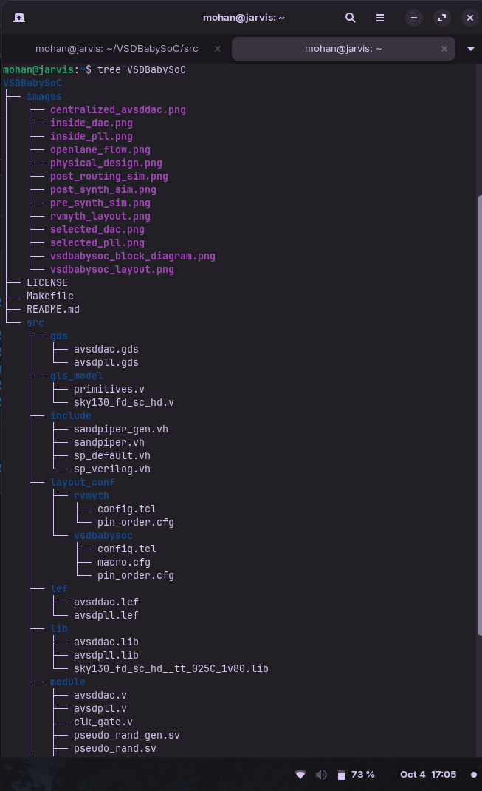


- `src/include/` - Contains header files (`*.vh`) with necessary macros or parameter definitions.
- `src/module/` - Contains Verilog files for each module in the SoC design.
- `output/` - Directory where compiled outputs and simulation files will be generated.


### **Verilog Source Files (`*.v`)**: 

 To see the RTL implemention of each components in the SoC :

  ### Navigate to VSDBabySoC , then src ,then modules. Inside the `modules folder`  these verilog codes are stored and modules is  inside src hence 
  
  Run:
  
  ```
   cd VSDBabySoC
   cd src
   cd module
  ```


### avsddac.v

- DAC (converts digital signals from CPU into analog output). 

  Run:

  ```
  gedit avsddac.v

  ```
 
 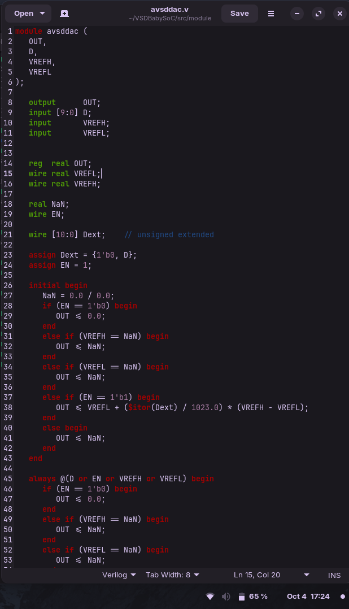


 **Inputs:**
- D[9:0] → 10-bit digital data from the CPU
- VREFH → High reference voltage for DAC
- VREFL → Low reference voltage for DAC

**Output:**
- OUT → Analog output voltage corresponding to digital input

  
### avsdpll.v
- PLL (generates stable clock from reference input).

Run:

  ```
  gedit avsdpll.v

  ```

  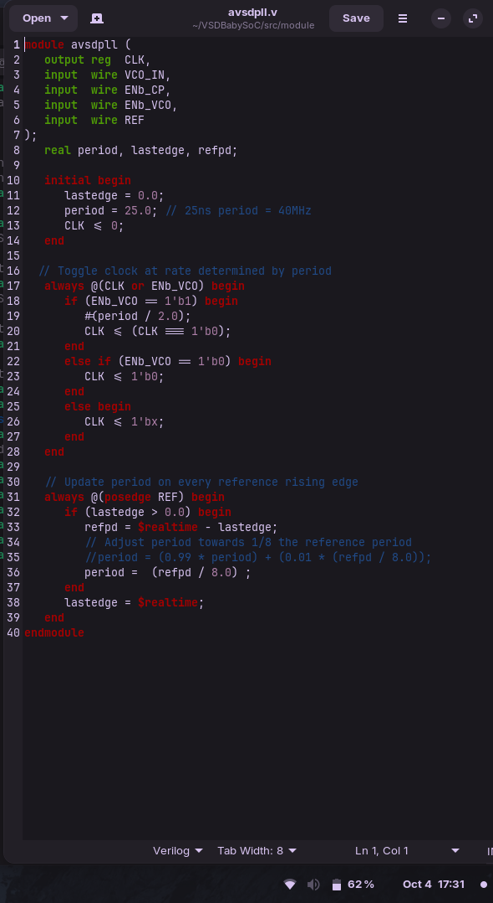

**Inputs:**
- VCO_IN → Voltage-Controlled Oscillator input (control signal)
- ENb_CP → Enable/disable charge pump
- ENb_VCO → Enable/disable VCO (clock generation)
- REF → Reference clock signal

**Output:**
- CLK → Generated stable clock signal (output from PLL)

### rvmyth.tlv

- **rvmyth.v** (compiled from `rvmyth.tlv`) → RISC-V CPU core (processes instructions and generates data).  

```verilog 
\m4_TLV_version 1d: tl-x.org
\SV
   m4_include_lib(['https://raw.githubusercontent.com/shivanishah269/risc-v-core/master/FPGA_Implementation/riscv_shell_lib.tlv'])
   
   // Module interface, either for Makerchip, or not.
   m4_ifelse_block(M4_MAKERCHIP, 1, ['
   // Makerchip module interface.
   m4_makerchip_module
   wire CLK = clk;
   logic [9:0] OUT;
   assign passed = cyc_cnt > 300;
   '], ['
   // Custom module interface for BabySoC.
   module rvmyth(
      output reg [9:0] OUT,
      input CLK,
      input reset
   );
   wire clk = CLK;
   '])
   
\TLV
   //
   m4_asm(ADDI, r9, r0, 1)
   m4_asm(ADDI, r10, r0, 101011)
   m4_asm(ADDI, r11, r0, 0)
   m4_asm(ADDI, r17, r0, 0)

   m4_asm(ADD, r17, r17, r11)
   m4_asm(ADDI, r11, r11, 1)
   m4_asm(BNE, r11, r10, 1111111111000)
   m4_asm(ADD, r17, r17, r11)

   m4_asm(SUB, r17, r17, r11)
   m4_asm(SUB, r11, r11, r9)
   m4_asm(BNE, r11, r9, 1111111111000)
   m4_asm(SUB, r17, r17, r11)

   m4_asm(BEQ, r0, r0, 1111111100000)
   //
   m4_define_hier(['M4_IMEM'], M4_NUM_INSTRS)
   //
   |cpu
      @0
         $reset = *reset;
      
      //Fetch
         // Next PC
         $pc[31:0] = (>>1$reset) ? 32'd0 : 
                     (>>3$valid_taken_br) ? >>3$br_tgt_pc : 
                     (>>3$valid_load) ? >>3$inc_pc : 
                     (>>3$valid_jump && >>3$is_jal) ? >>3$br_tgt_pc :
                     (>>3$valid_jump && >>3$is_jalr) ? >>3$jalr_tgt_pc : >>1$inc_pc;
         
         $imem_rd_en = !$reset;
         $imem_rd_addr[31:0] = $pc[M4_IMEM_INDEX_CNT+1:2];
         
      @1         
         $instr[31:0] = $imem_rd_data[31:0];
         $inc_pc[31:0] = $pc + 32'd4;          
      // Decode   
         $is_i_instr = $instr[6:2] == 5'b00000 ||
                       $instr[6:2] == 5'b00001 ||
                       $instr[6:2] == 5'b00100 ||
                       $instr[6:2] == 5'b00110 ||
                       $instr[6:2] == 5'b11001;
         $is_r_instr = $instr[6:2] == 5'b01011 ||
                       $instr[6:2] == 5'b10100 ||
                       $instr[6:2] == 5'b01100 ||
                       $instr[6:2] == 5'b01101;                       
         $is_b_instr = $instr[6:2] == 5'b11000;
         $is_u_instr = $instr[6:2] == 5'b00101 ||
                       $instr[6:2] == 5'b01101;
         $is_s_instr = $instr[6:2] == 5'b01000 ||
                       $instr[6:2] == 5'b01001;
         $is_j_instr = $instr[6:2] == 5'b11011;
         
         $imm[31:0] = $is_i_instr ? { {21{$instr[31]}} , $instr[30:20] } :
                      $is_s_instr ? { {21{$instr[31]}} , $instr[30:25] , $instr[11:8] , $instr[7] } :
                      $is_b_instr ? { {20{$instr[31]}} , $instr[7] , $instr[30:25] , $instr[11:8] , 1'b0} :
                      $is_u_instr ? { $instr[31:12] , 12'b0} : 
                      $is_j_instr ? { {12{$instr[31]}} , $instr[19:12] , $instr[20] , $instr[30:21] , 1'b0} : 32'b0;
         
         $rs2_valid = $is_r_instr || $is_s_instr || $is_b_instr;
         $rs1_valid = $is_r_instr || $is_s_instr || $is_b_instr || $is_i_instr;
         $rd_valid = $is_r_instr || $is_i_instr || $is_u_instr || $is_j_instr;
         $funct3_valid = $is_r_instr || $is_s_instr || $is_b_instr || $is_i_instr;
         $funct7_valid = $is_r_instr;
         
         ?$rs2_valid
            $rs2[4:0] = $instr[24:20];
         ?$rs1_valid
            $rs1[4:0] = $instr[19:15];
         ?$rd_valid
            $rd[4:0] = $instr[11:7];
         ?$funct3_valid
            $funct3[2:0] = $instr[14:12];
         ?$funct7_valid
            $funct7[6:0] = $instr[31:25];
            
         $opcode[6:0] = $instr[6:0];
         
         $dec_bits[10:0] = {$funct7[5],$funct3,$opcode};
         
         // Branch Instruction
         $is_beq = $dec_bits[9:0] == 10'b000_1100011;
         $is_bne = $dec_bits[9:0] == 10'b001_1100011;
         $is_blt = $dec_bits[9:0] == 10'b100_1100011;
         $is_bge = $dec_bits[9:0] == 10'b101_1100011;
         $is_bltu = $dec_bits[9:0] == 10'b110_1100011;
         $is_bgeu = $dec_bits[9:0] == 10'b111_1100011;
         
         // Arithmetic Instruction
         $is_add = $dec_bits == 11'b0_000_0110011;
         $is_addi = $dec_bits[9:0] == 10'b000_0010011;
         $is_or = $dec_bits == 11'b0_110_0110011;
         $is_ori = $dec_bits[9:0] == 10'b110_0010011;
         $is_xor = $dec_bits == 11'b0_100_0110011;
         $is_xori = $dec_bits[9:0] == 10'b100_0010011;
         $is_and = $dec_bits == 11'b0_111_0110011;
         $is_andi = $dec_bits[9:0] == 10'b111_0010011;
         $is_sub = $dec_bits == 11'b1_000_0110011;
         $is_slti = $dec_bits[9:0] == 10'b010_0010011;
         $is_sltiu = $dec_bits[9:0] == 10'b011_0010011;
         $is_slli = $dec_bits == 11'b0_001_0010011;
         $is_srli = $dec_bits == 11'b0_101_0010011;
         $is_srai = $dec_bits == 11'b1_101_0010011;
         $is_sll = $dec_bits == 11'b0_001_0110011;
         $is_slt = $dec_bits == 11'b0_010_0110011;
         $is_sltu = $dec_bits == 11'b0_011_0110011;
         $is_srl = $dec_bits == 11'b0_101_0110011;
         $is_sra = $dec_bits == 11'b1_101_0110011;
         
         // Load Instruction
         $is_load = $dec_bits[6:0] == 7'b0000011;
         
         // Store Instruction
         $is_sb = $dec_bits[9:0] == 10'b000_0100011;
         $is_sh = $dec_bits[9:0] == 10'b001_0100011;
         $is_sw = $dec_bits[9:0] == 10'b010_0100011;
         
         // Jump Instruction
         $is_lui = $dec_bits[6:0] == 7'b0110111;
         $is_auipc = $dec_bits[6:0] == 7'b0010111;
         $is_jal = $dec_bits[6:0] == 7'b1101111;
         $is_jalr = $dec_bits[9:0] == 10'b000_1100111;
         
         $is_jump = $is_jal || $is_jalr;
         
      @2   
      // Register File Read
         $rf_rd_en1 = $rs1_valid;
         ?$rf_rd_en1
            $rf_rd_index1[4:0] = $rs1[4:0];
         
         $rf_rd_en2 = $rs2_valid;
         ?$rf_rd_en2
            $rf_rd_index2[4:0] = $rs2[4:0];
            
      // Branch Target PC       
         $br_tgt_pc[31:0] = $pc + $imm;
      
      // Jump Target PC
         $jalr_tgt_pc[31:0] = $src1_value + $imm;
         
      // Input signals to ALU
         $src1_value[31:0] = ((>>1$rd == $rs1) && >>1$rf_wr_en) ? >>1$result : $rf_rd_data1[31:0];
         $src2_value[31:0] = ((>>1$rd == $rs2) && >>1$rf_wr_en) ? >>1$result : $rf_rd_data2[31:0];
         
      @3   
         
      // ALU
         $sltu_result = $src1_value < $src2_value ;
         $sltiu_result = $src1_value < $imm ;
         
         $result[31:0] = $is_addi ? $src1_value + $imm :
                         $is_add ? $src1_value + $src2_value : 
                         $is_or ? $src1_value | $src2_value : 
                         $is_ori ? $src1_value | $imm :
                         $is_xor ? $src1_value ^ $src2_value :
                         $is_xori ? $src1_value ^ $imm :
                         $is_and ? $src1_value & $src2_value :
                         $is_andi ? $src1_value & $imm :
                         $is_sub ? $src1_value - $src2_value :
                         $is_slti ? (($src1_value[31] == $imm[31]) ? $sltiu_result : {31'b0,$src1_value[31]}) :
                         $is_sltiu ? $sltiu_result :
                         $is_slli ? $src1_value << $imm[5:0] :
                         $is_srli ? $src1_value >> $imm[5:0] :
                         $is_srai ? ({{32{$src1_value[31]}}, $src1_value} >> $imm[4:0]) :
                         $is_sll ? $src1_value << $src2_value[4:0] :
                         $is_slt ? (($src1_value[31] == $src2_value[31]) ? $sltu_result : {31'b0,$src1_value[31]}) :
                         $is_sltu ? $sltu_result :
                         $is_srl ? $src1_value >> $src2_value[5:0] :
                         $is_sra ? ({{32{$src1_value[31]}}, $src1_value} >> $src2_value[4:0]) :
                         $is_lui ? ({$imm[31:12], 12'b0}) :
                         $is_auipc ? $pc + $imm :
                         $is_jal ? $pc + 4 :
                         $is_jalr ? $pc + 4 : 
                         ($is_load || $is_s_instr) ? $src1_value + $imm : 32'bx;
                         
      // Register File Write
         $rf_wr_en = ($rd_valid && $valid && $rd != 5'b0) || >>2$valid_load;
         ?$rf_wr_en
            $rf_wr_index[4:0] = !$valid ? >>2$rd[4:0] : $rd[4:0];
      
         $rf_wr_data[31:0] = !$valid ? >>2$ld_data[31:0] : $result[31:0];
      
      // Branch
         $taken_br = $is_beq ? ($src1_value == $src2_value) :
                     $is_bne ? ($src1_value != $src2_value) :
                     $is_blt ? (($src1_value < $src2_value) ^ ($src1_value[31] != $src2_value[31])) :
                     $is_bge ? (($src1_value >= $src2_value) ^ ($src1_value[31] != $src2_value[31])) :
                     $is_bltu ? ($src1_value < $src2_value) :
                     $is_bgeu ? ($src1_value >= $src2_value) : 1'b0;
                     
         $valid_taken_br = $valid && $taken_br;
         
      // Load
         $valid_load = $valid && $is_load;
         $valid = !(>>1$valid_taken_br || >>2$valid_taken_br || >>1$valid_load || >>2$valid_load || >>1$valid_jump || >>2$valid_jump);
      
      // Jump
         $valid_jump = $valid && $is_jump;
                  
      @4
         $dmem_rd_en = $valid_load;
         $dmem_wr_en = $valid && $is_s_instr;
         $dmem_addr[3:0] = $result[5:2];
         $dmem_wr_data[31:0] = $src2_value[31:0];
         
      @5   
         $ld_data[31:0] = $dmem_rd_data[31:0];
         
      // Note: Because of the magic we are using for visualisation, if visualisation is enabled below,
      //       be sure to avoid having unassigned signals (which you might be using for random inputs)
      //       other than those specifically expected in the labs. You'll get strange errors for these.

         `BOGUS_USE($is_beq $is_bne $is_blt $is_bge $is_bltu $is_bgeu)
         `BOGUS_USE($is_sb $is_sh $is_sw)
   // Assert these to end simulation (before Makerchip cycle limit).
   \SV_plus
      always @ (posedge CLK) begin
         *OUT = |cpu/xreg[17]>>5$value;                
      end
   
   // Macro instantiations for:
   //  o instruction memory
   //  o register file
   //  o data memory
   //  o CPU visualization
   |cpu
      m4+imem(@1)    // Args: (read stage)
      m4+rf(@2, @3)  // Args: (read stage, write stage) - if equal, no register bypass is required
      m4+dmem(@4)    // Args: (read/write stage)

     
\SV
   
   endmodule
   ```

**Inputs:**
- CLK → Clock signal for synchronizing CPU operations
- reset → Reset signal to initialize CPU registers and program counter

**Outputs:**
- OUT [9:0] → 10-bit output from CPU, used to visualize internal CPU state (e.g., for simulation/teaching purposes)

### vsdbabysoc.v 

- Top-level integration module (connects CPU, PLL, and DAC into a complete SoC).  

Run:

  ```
  gedit vsdbabysoc.v

  ```

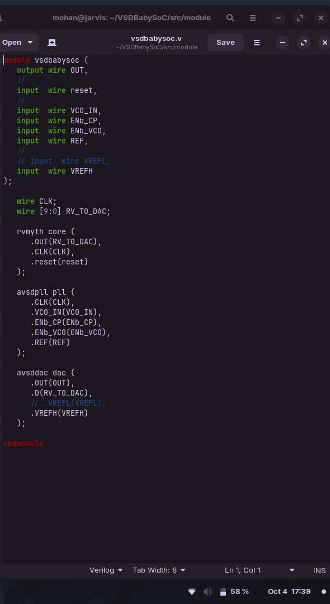


**Inputs:**
- reset → Resets the entire SoC, initializing CPU and modules
- VCO_IN → Input for the PLL (voltage-controlled oscillator signal)
- ENb_CP → PLL control input (charge pump enable/disable)
- ENb_VCO → PLL control input (VCO enable/disable)
- REF → Reference clock input for the PLL
- VREFH → High reference voltage for the DAC

**Outputs:**
- OUT → Analog output from DAC, representing digital CPU output as analog voltage

---

## **Testbench for BabySoC**

**Purpose:**  
- Verifies the functionality of the complete BabySoC design.  
- Provides input stimuli to the SoC and monitors the outputs.  
- Generates waveforms for simulation and debugging using GTKWave.  

**Functionality Tested:**  
- Instruction execution of the RISC-V CPU (`rvmyth`)  
- ALU operations and arithmetic/logical computations  
- Register file reads and writes  
- Memory interactions (instruction and data memory)  

**Waveform Files:**  
- `pre_synth_sim.vcd` → Captures signal activity before synthesis  
- `post_synth_sim.vcd` → Captures signal activity after synthesis  

**Usage:**  
- Open `.vcd` files in GTKWave to visualize signals and analyze SoC behavior in a controlled simulation environment.

---

Before compiling the Verilog source files, the rvmyth.tlv file must first be converted to a .v file using sandpiper.

1. First we need to install some important packages:

```bash
sudo apt install make python python3 python3-pip git iverilog gtkwave docker.io
cd ~
pip3 install pyyaml click sandpiper-saas
```

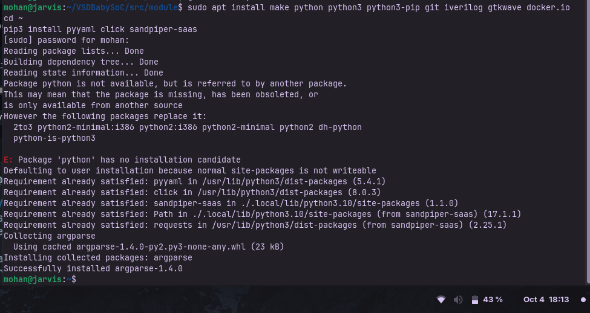

To compile the rvmyth.tlv file with sandpiper, run:

```bash
python3 -m sandpiper -i ~/Documents/Verilog/Labs/VSDBabySoC/src/module/rvmyth.tlv -o rvmyth.v  --bestsv --noline -p verilog --outdir ~/Documents/Verilog/Labs/VSDBabySoC/src/module
```


This command stores the compiled `rvmyth.v` and `rvmyth_gen.v` files inside `~/VSDBabySoC/src/module`.

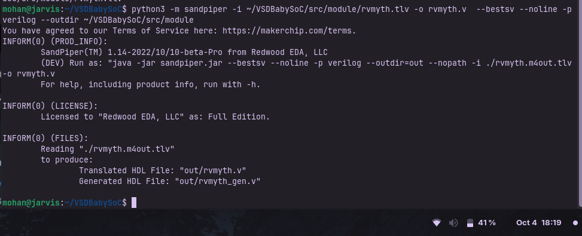

---

## RTL Simulation of Modules

**avsddac.v**

```bash
iverilog -o ~/avsddac.vvp ~/VSDBabySoC/src/module/avsddac.v ~/VSDBabySoC/src/module/tb_avsddac.v

```
Testbench ported from [rvmyth_avsddac_interface](https://github.com/vsdip/rvmyth_avsddac_interface/blob/main/iverilog/Pre-synthesis/avsddac_tb_test.v) 

repository and pasted in this path `/VSDBabySoC/src/module/` , same procedure to save the tb files of all 

```bash
cd 
vvp avsddac.vvp
gtkwave tb_avsddac.vcd
```

_Waveform_ :

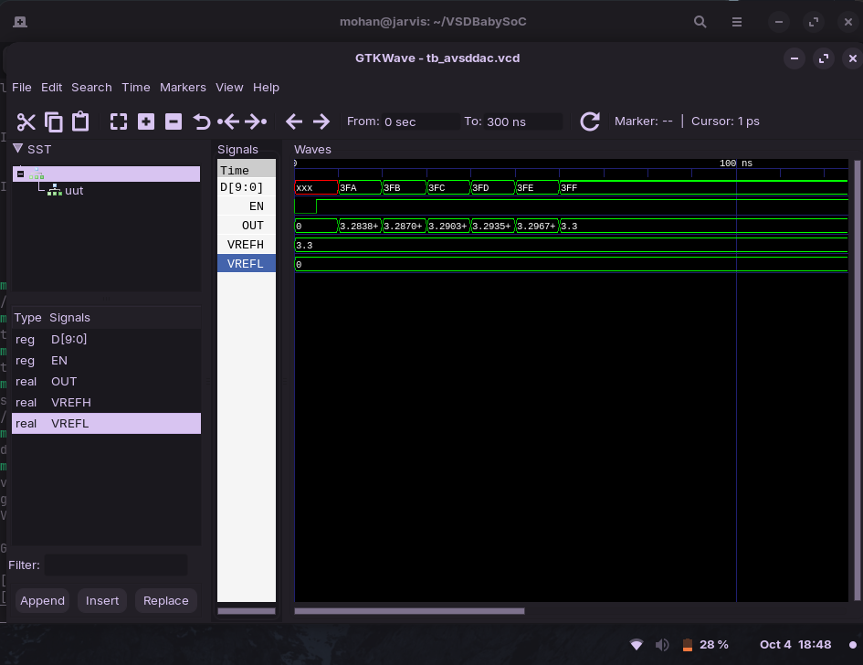

_Analysis_ :

- `D` = _3FE_ -> Dext = 1022
- `OUT` = VREFL + ( (Dext​ / 1023)  * (VREFH−VREFL) )
- `OUT` = 0 + (1022 / 1023) * 3.3 ≈ 3.2968 V
- Waveform: `OUT` ≈ 3.297 V while `D` stays at _3FE_
- Demonstrates DAC step behavior near full scale

---

**avsdpll.v**

**Navigate to VSDBabySoC**

```bash
cd VSDBabySoC
```

```bash
iverilog -o ~/avsdpll.vvp ~/VSDBabySoC/src/module/avsdpll.v ~/VSDBabySoC/src/module/tb_avsdpll.v
```
Testbench ported from [rvmyth_avsdpll_interface](https://github.com/vsdip/rvmyth_avsdpll_interface/blob/main/verilog/pll_tb.v) repository

```bash
cd 
vvp avsdpll.vvp
gtkwave tb_dpll.vcd
```

_Waveform_:

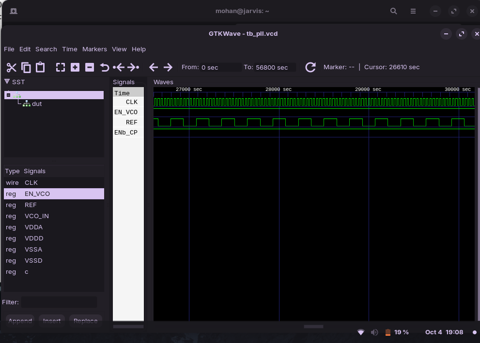

_Analysis_ :

- `REF`: input clock, slower reference signal
- Each rising edge of `REF` recalculates `refpd` (`REF` period)
- `CLK`: output clock, toggles continuously when `ENb_VCO` = 1
- `CLK` frequency = 8 × `REF` frequency (since period = `refpd` / 8)
- When `ENb_VCO` = 0 → `CLK` forced to 0
- When `ENb_VCO` = `X` → `CLK` becomes `X` (unknown)

---

**`rvmyth.v`**

**Navigate to VSDBabySoC**

```bash
cd VSDBabySoC
```

```bash
iverilog -o ~/rvmyth.vvp -I  ~/VSDBabySoC/src/include -I  ~/VSDBabySoC/src/module  ~/VSDBabySoC/src/module/rvmyth.v ~/VSDBabySoC/src/module/tb_rvmyth.v ~/VSDBabySoC/src/module/clk_gate.v
```

Testbench ported from [rvmyth](https://github.com/kunalg123/rvmyth/blob/main/tb_mythcore_test.v) repository

```bash
cd 
vvp rvmyth.vvp
gtkwave tb_rvmyth.vcd
```

_Waveform_:

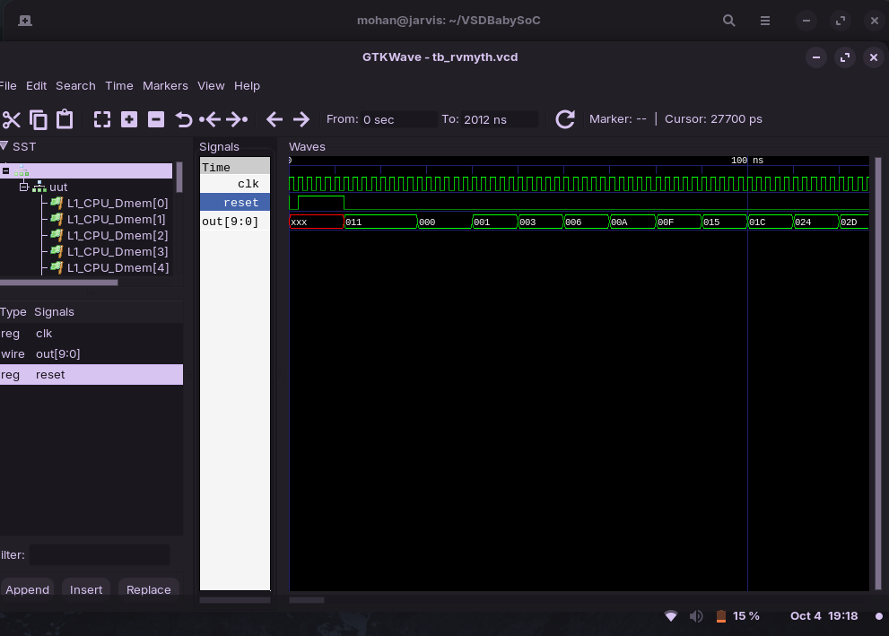

_Analysis_ :

- `CLK`     : Provides timing for the core.
- `reset`  : Initializes core to known state.
- `OUT`     : 10-bit Register output.

---


## Pre-synthesis Simulation of VSDBabySoC

   The pre-synthesis simulation is done using Icarus Verilog (iverilog) followed by waveform viewing in GTKWave.

**First Navigate to VSDBabySoC**

```bash
cd VSDBabySoC
```  
   
### Compile the Design:
```bash
iverilog -o ~/pre_synth_sim.vvp -DPRE_SYNTH_SIM \
    -I  ~/VSDBabySoC/src/include -I  ~/VSDBabySoC/src/module \
    ~/VSDBabySoC/src/module/testbench.v

```
- -DPRE_SYNTH_SIM	            - Defines a macro for pre-synthesis simulation mode
- -I ~/VSDBabySoC/src/include -	Include directory for header files (.vh)
- -I ~/VSDBabySoC/src/module  -	Include directory for module source files

```bash
cd
vvp pre_synth_sim.vvp
gtkwave pre_synth_sim.vcd
```

waveform :

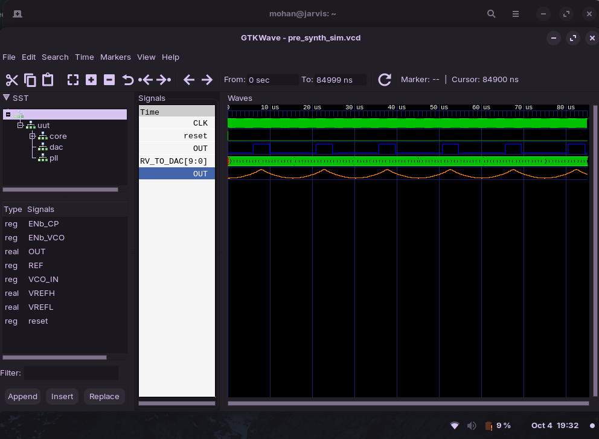

##  Signal Analysis

During the simulation, the following important signals are analyzed:

- **`CLK`**  
  Acts as the primary **clock source** for the RVMYTH core. It is generated using the PLL and drives the entire SoC’s timing.

- **`reset`**   
  The **active-high reset signal**, provided externally to initialize the core. It ensures that all modules begin from a defined state during simulation.

- **`OUT`** 
  Represents the **final output** of the VSDBabySoC. This signal is generated by the DAC.  
  In simulation, it is treated as a **digital signal**, although in actual hardware it would be **analog**.

- **`RV_TO_DAC[9:0]`**  
  A **10-bit bus** carrying data from the RVMYTH core to the DAC. These digital values are what the DAC would normally convert to analog voltage levels.

- **`OUT (real)`**   
  A **real-type wire** used to simulate the DAC’s analog output within the waveform. This allows observing analog-like behavior in GTKWave.

---

## 🧪 Post-synthesis Simulation of VSDBabySoC

### 🛠️ Synthesis Phase

Before performing post-synthesis simulations, you need to make sure that all the **essential header files** required by the `rvmyth` module are available.  
These files provide macros, tool-generated configurations, and integration settings required during synthesis.

The required header files are:

- **`sp_verilog.vh`**  
  Contains core Verilog macros and key parameter definitions used in the design.

- **`sandpiper.vh`**  
  Defines integration-specific configurations needed for SandPiper-based modules.

- **`sandpiper_gen.vh`**  
  Holds auto-generated parameters and tool settings that are essential for synthesis.

All these files must be copied into the **working directory** of `yosys` before running the synthesis flow.  
If they’re missing, synthesis may fail due to undefined macros or missing parameter references.


```bash

# Copy required header files to the yosys working directory
cd ~/VSDBabySoC
cp -r src/include/sp_verilog.vh .
cp -r src/include/sandpiper.vh .
cp -r src/include/sandpiper_gen.vh .
```

inside the `/VSDBabySoC` folder, run `yosys`.

```bash
yosys
```
Then run the following commands to read verilog files  :

```bash
read_verilog src/module/vsdbabysoc.v 
read_verilog -I ~/VSDBabySoC/src/include/ ~/VSDBabySoC/src/module/rvmyth.v
read_verilog -I ~/VSDBabySoC/src/include/ ~/VSDBabySoC/src/module/clk_gate.v
```

then run the command to read the liberty files :

```bash
read_liberty -lib ~/VSDBabySoC/src/lib/avsdpll.lib 
read_liberty -lib ~/VSDBabySoC/src/lib/avsddac.lib 
read_liberty -lib ~/VSDBabySoC/src/lib/sky130_fd_sc_hd__tt_025C_1v80.lib
```

Then , Synthesize **vsdbabysoc**, specifying it as the top module,

```bash
synth -top vsdbabysoc
```
Convert D Flip-Flops into equivalent Standard Cell instances 

Run:
```bash
dfflibmap -liberty ~/Documents/Verilog/Labs/VSDBabySoC/src/lib/sky130_fd_sc_hd__tt_025C_1v80.lib
```

Perform Optimization and Technology mapping 

```bash
opt
abc -liberty ~/Documents/Verilog/Labs/VSDBabySoC/src/lib/sky130_fd_sc_hd__tt_025C_1v80.lib -script +strash;scorr;ifraig;retime;{D};strash;dch,-f;map,-M,1,{D}
```


 `strash`       - Structural hashing — converts logic network to an AIG (And-Inverter Graph). 
 `scorr`        - Sequential redundancy removal — detects equivalent registers.               
 `ifraig`       - Combinational equivalence simplification.                                   
 `retime`       - Moves flip-flops for timing optimization.                                   
 `{D}`          - Placeholder or marker for design partition (used internally by Yosys/ABC).  
 `strash`       - Re-run structural hashing after retiming.                                   
 `dch,-f`       - Performs combinational optimization (don’t-care-based).                     
 `map,-M,1,{D}` - Maps the logic to gates in the provided `.lib` standard cell library.       


Then, conduct final optimisations and clean-up through,

```bash
flatten
setundef -zero
clean -purge
rename -enumerate
```

- flatten          : Remove hierarchy, make a flat netlist \
- setundef -zero   : Replace undefined signals with 0 \
- clean -purge     : Delete unused/duplicate logic \
- rename -enumerate: Systematically rename nets and cells

To check the statistics of the synthesised design run,

```bash
stat
```

### Statistics

<pre>

=== vsdbabysoc ===

        +----------Local Count, excluding submodules.
        | 
     4736 wires
     6210 wire bits
     4736 public wires
     6210 public wire bits
        7 ports
        7 port bits
     5920 cells
        8   $scopeinfo
        1   avsddac
        1   avsdpll
       10   sky130_fd_sc_hd__a2111oi_0
        1   sky130_fd_sc_hd__a211o_2
       26   sky130_fd_sc_hd__a211oi_1
        4   sky130_fd_sc_hd__a21boi_0
        1   sky130_fd_sc_hd__a21o_2
      672   sky130_fd_sc_hd__a21oi_1
        1   sky130_fd_sc_hd__a221o_2
      163   sky130_fd_sc_hd__a221oi_1
        4   sky130_fd_sc_hd__a22o_2
      123   sky130_fd_sc_hd__a22oi_1
        4   sky130_fd_sc_hd__a311oi_1
        1   sky130_fd_sc_hd__a31o_2
      344   sky130_fd_sc_hd__a31oi_1
        2   sky130_fd_sc_hd__a32oi_1
       26   sky130_fd_sc_hd__a41oi_1
       12   sky130_fd_sc_hd__and2_2
        1   sky130_fd_sc_hd__and3_2
      597   sky130_fd_sc_hd__clkinv_1
     1144   sky130_fd_sc_hd__dfxtp_1
        1   sky130_fd_sc_hd__lpflow_inputiso0p_1
       12   sky130_fd_sc_hd__mux2i_1
      839   sky130_fd_sc_hd__nand2_1
      249   sky130_fd_sc_hd__nand3_1
        1   sky130_fd_sc_hd__nand3b_1
       41   sky130_fd_sc_hd__nand4_1
      403   sky130_fd_sc_hd__nor2_1
       35   sky130_fd_sc_hd__nor3_1
        2   sky130_fd_sc_hd__nor4_1
       20   sky130_fd_sc_hd__o2111ai_1
        1   sky130_fd_sc_hd__o211a_1
       49   sky130_fd_sc_hd__o211ai_1
        6   sky130_fd_sc_hd__o21a_1
      866   sky130_fd_sc_hd__o21ai_0
        1   sky130_fd_sc_hd__o21ba_2
       18   sky130_fd_sc_hd__o21bai_1
        1   sky130_fd_sc_hd__o221a_2
        7   sky130_fd_sc_hd__o221ai_1
      155   sky130_fd_sc_hd__o22ai_1
        1   sky130_fd_sc_hd__o2bb2ai_1
        2   sky130_fd_sc_hd__o311ai_0
        3   sky130_fd_sc_hd__o31ai_1
        1   sky130_fd_sc_hd__o32ai_1
        1   sky130_fd_sc_hd__o41ai_1
       12   sky130_fd_sc_hd__or2_2
        1   sky130_fd_sc_hd__or3_2
        1   sky130_fd_sc_hd__or4_2
       13   sky130_fd_sc_hd__xnor2_1
       32   sky130_fd_sc_hd__xor2_1

</pre>

write the netlist using,

```bash
write_verilog -noattr ~/vsdbabysoc.synth.v
```


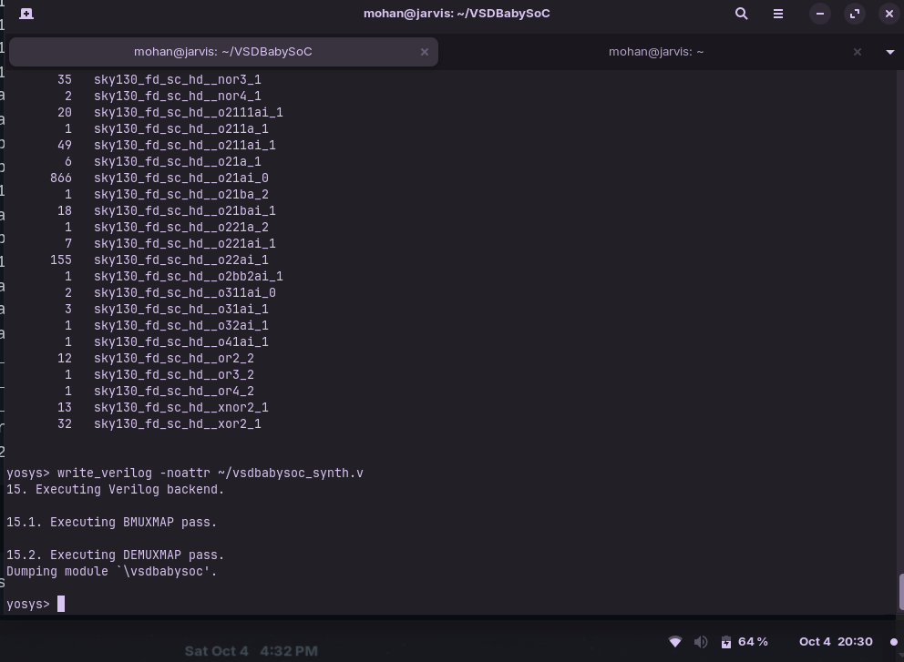

Make sure the following files are present in your current current directory (`home`) prior to starting compilation.

- vsdbabysoc_synth.v
- avsddac.v
- avsdpll.v
- primitives.v
- sky130_fd_sc_hd.v

this is done using,

```bash
cp -r ~/VSDBabySoC/src/module/avsddac.v .
cp -r ~/VSDBabySoC/src/module/avsdpll.v .
cp -r ~/VSDBabySoC/src/gls_model/sky130_fd_sc_hd.v .
cp -r ~/VSDBabySoC/src/gls_model/primitives.v .
```

the netlist along with the testbench should be compiled using iverilog with the following command,

```bash
iverilog -o ~/vsdbabysoc_synth.vvp -DPOST_SYNTH_SIM -DFUNCTIONAL -DUNIT_DELAY=#1 -I ~/VSDBabySoC/src/include -I ~/VSDBabySoC/src/module -I  ~/VSDBabySoC/src/gls_model ~/VSDBabySoC/src/module/testbench.v
```
> [!Note]
> copy the test bench from the module folder and past it in the curren working directory ('home')

`-DPOST_SYNTH_SIM` | Defines the macro `POST_SYNTH_SIM` to enable post-synthesis simulation mode. \
`-DFUNCTIONAL`     | Defines the macro `FUNCTIONAL` to select functional simulation mode. \      
`-DUNIT_DELAY=#1`  | Defines the macro `UNIT_DELAY` with value `#1` for unit delay parameterization in simulation. 

to view the waveform,

```bash
vvp vsdbabysoc_synth.vvp
gtkwave post_synth_sim.vcd 
```
---
_waveform_

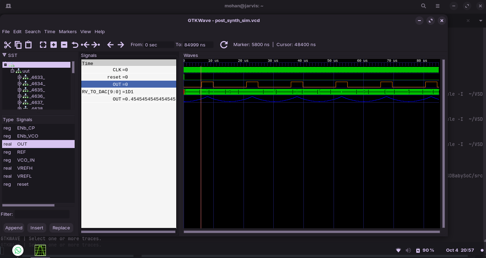